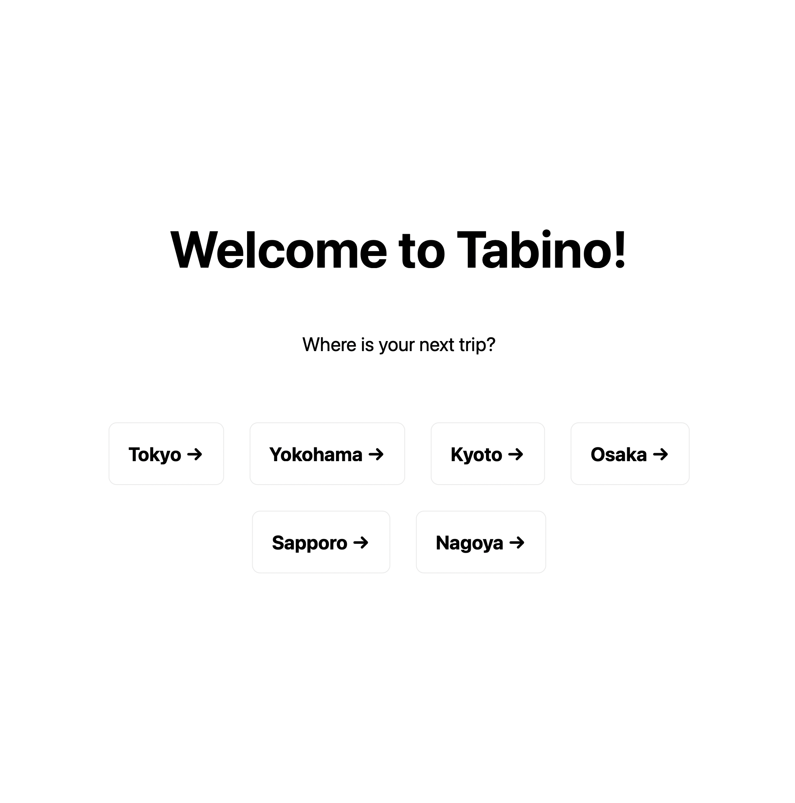
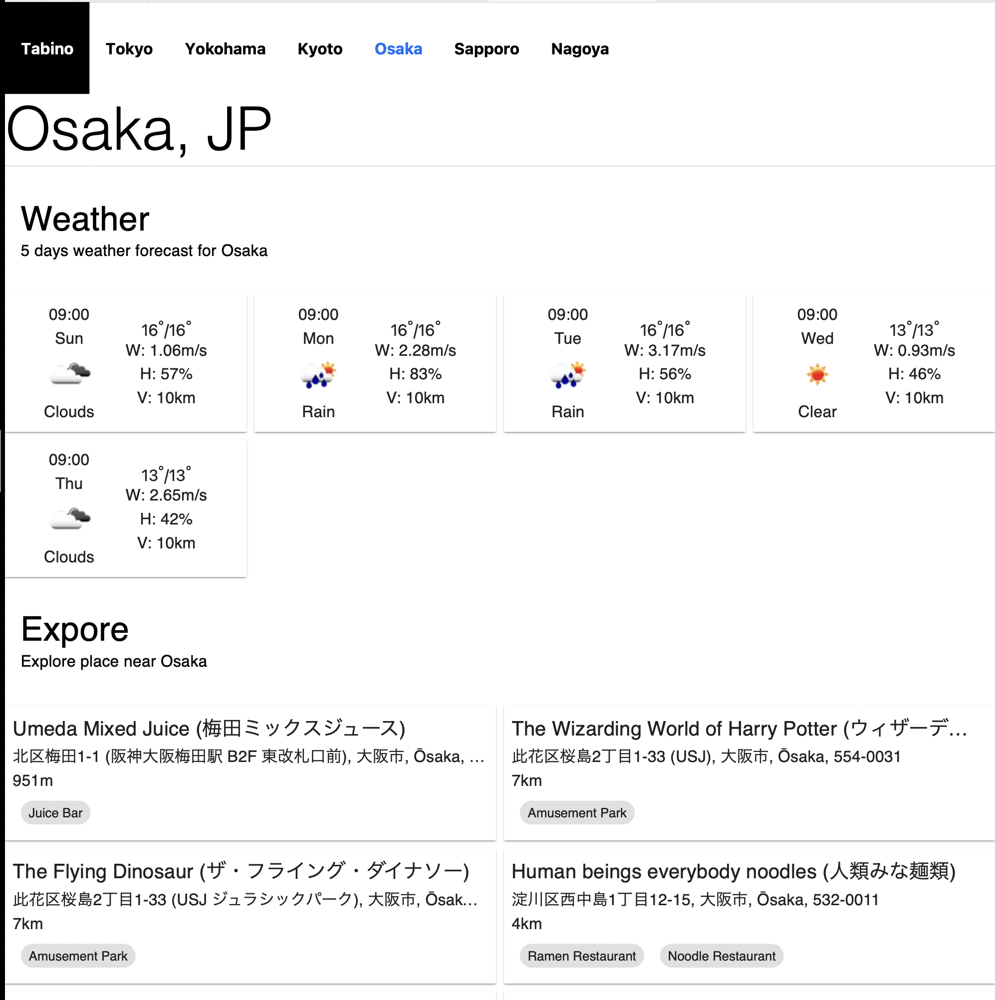

# Tabino

Tabi(旅)no - a simple web application that provide useful information for foreign travelers who are visting Japan for the first time.

## Features

The application have 2 pages:

- Home page that show a list of supported city. The first version support following cities: Tokyo, Yokohama, Kyoto, Osaka, Sapporo, Nagoya.
- Detail information for specified city `/{city}`.

In detail page of each city, the application provide:

- Weather forecast for next 5 days - powered by OpenWeatherMap API.
- Up to 10 places with highest rating arround the city - powered by Foursquare API.

## Techinal

This application use NextJs to serve both back-end and front-end resources.
Because of there are no user-specied data, all pages are pre-rendered by the server, and was cached for an hour (this also help reduce number of requests need to call 3rd party APIs, that will cost time and money).

We use ReactJs and some resources from MaterialUI + StyledComponents for build the responsive user interface.

### Folder structures

The project follow the following structure:

- components/ - contains all React components, each feature has it's folder and shared components is in `common` folder.
- config/- related to application configurations.
- pages/ - contains pages of the application. Each page is React Component associated with a route based on its file name.
- public/ - contains static files, like images, etc..
- services/ - contains logic related to access database, or 3rd party services.
- styles - contains css files.
- utils - contains utilities for repetitive tasks.

### How to use

Requires:

- node 14 or later
- yarn

After check out the project, run `yarn install` to install dependencies.

Create `.env.local` file and set the values for API keys:

```text
ENV_OPENWEATHERMAP_API_KEY=<enter-your-api-key>
ENV_FOURSQUARE_API_KEY=<enter-your-api-key>
```

Then run `yarn start`, it will build the project and start web server.
Open browser and enter `http://localhost:3000` to access the application.


Click on specified city to check detail.

